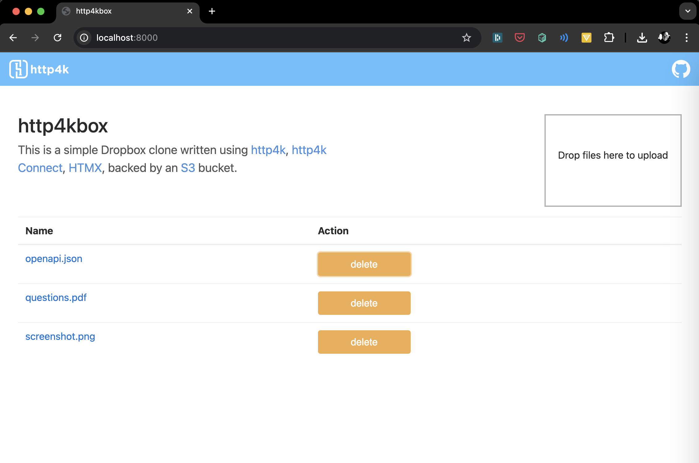

# http4kbox - http4k app deployed in multiple modes

This is a simple Dropbox clone built with [**http4k**](https://http4k.org) which uses S3 as a backing store, implemented
in ~50 lines of code (when imports are excluded). It is designed to demo that http4k apps run identically in the
following modes:

1. As a Kotlin function with SunHttp dev server for tests - see [app](./app)
1. In a deployed local Undertow server + Apache HTTP client - see [local](./local)
1. To Heroku as a cloud-based Helidon server (with Helidon client) deployed through a fully CD pipeline run on GitHubActions -
   see [heroku](./heroku-app)
1. Into a Kubernetes cluster - see [k8s](./k8s)
1. As a pure Kotlin function deployed in a Serverless environment (AWS Lambda) - see [serverless](./serverless)
1. As a native Apache server binary running in GraalVM - see [native](./native)

Apart from the switchable server backen   ds and clients, the core app uses the following [**http4k**](https://http4k.org)
modules and features:

- `http4k-core` <-- main HTTP library
- `http4k-config` <-- for 12-factor configuration via environmental properties
- `http4k-connect-amazon-s3` <-- replaces the Java AWS SDK with a lightweight http4k client
- `http4k-template-rocker` <-- for templating
- `http4k-multipart` <-- multipart form uploads
- `http4k-testing-hamkrest` <-- for test assertions

## In action:

